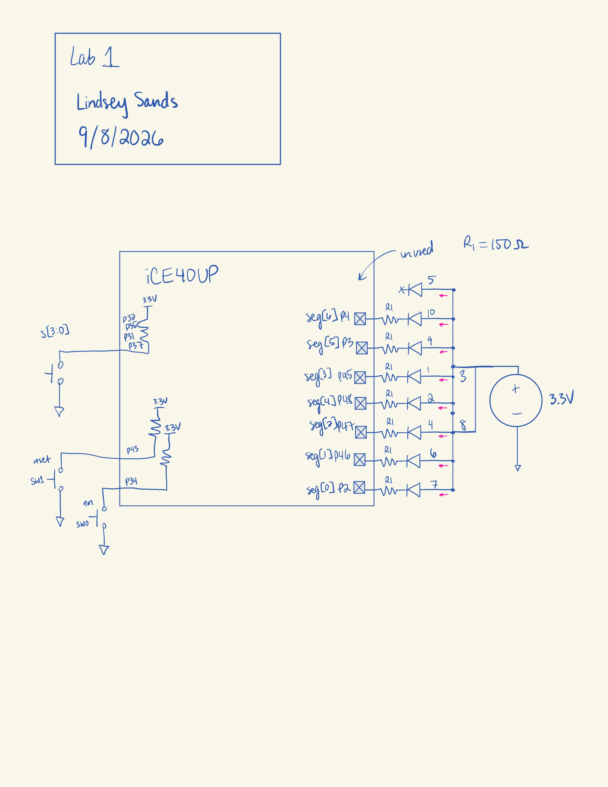

## Introduction
In this lab, an FPGA was programmed to control multiple LEDs. One LED blinked at 2.4 Hz. Two other LEDs executed AND and XOR operations based on a 4-bit switch input. Finally, the last 7 LEDs were part of a seven segment display and are configured to display the hex digits from 0x0 to 0xF based on the same switch input. 

## Design and Testing Methodology
For the blinking LED, a 48 MHz clock signal was generated from the on-board high-speed oscillator (HSOSC) from the iCE40 UltraPlus primitive library.

The necessary maximum count for a counter module was calculated in order to turn the 48 MHz input into the 2.4 Hz output, as shown in Figure 1 below. 

{width=80%}

Using this calculation, a counter module was designed with parameters of width and maximum count set to 24'd10_000_000 and 25, respectively. The counter module also has reset and enable functionality. 

Additionally, there were calculations performed to figure out the proper pull-down resistor size for the seven segment display LEDs. Using the information from the data, a target current draw of 8mA was chosen. 

{width=80%}

A standard resistor size of 150 Ω based on the calculation in Figure 2.

The top module handles the logic of the last two LEDs, assigning the XOR and AND logic. The top module is also where the HSOSC, counter, and seven segment display modules are all integrated together. 

## Technical Documentation
The source code for the project can be found in the associated [Github repository](https://github.com/lsands5400/e155-lab1.git).

# Block Diagram 
{width=80%}

# Schematic
TODO: fix this and add the FPGA and internal pull up resistors and buttons and switches
{width=80%}

## Results and Discussion
TODO: complete this
# Testbench Simulation
All of the testbenches ran successfully with no errors. 

::: {.callout-caution collapse="true" title="Click for Questa Simulation"}
{width=100%}
:::
All 16 LED configurations work. 

::: {.callout-caution collapse="true" title="Click for Questa Simulation"}
{width=100%}
The active low reset functionality sets the counter back to zero.
:::

::: {.callout-caution collapse="true" title="Click for Questa Simulation"}
{width=100%}
:::
When high, enable allows the counter to increment. When low, the counter stays at the same value unless reset is pressed.

::: {.callout-caution collapse="true" title="Click for Questa Simulation"}
{width=100%}
:::
When the counter reaches the maximum count, instead of continuing to count up, it resets to 0.

::: {.callout-caution collapse="true" title="Click for Questa Simulation"}
{width=100%}
:::
All of the integrated modules and LED logic works. 

## Conclusion
TODO: Did everything work?
I spent about 25-30 hours on this lab.

## AI Prototype Summary
TODO: Finish this
