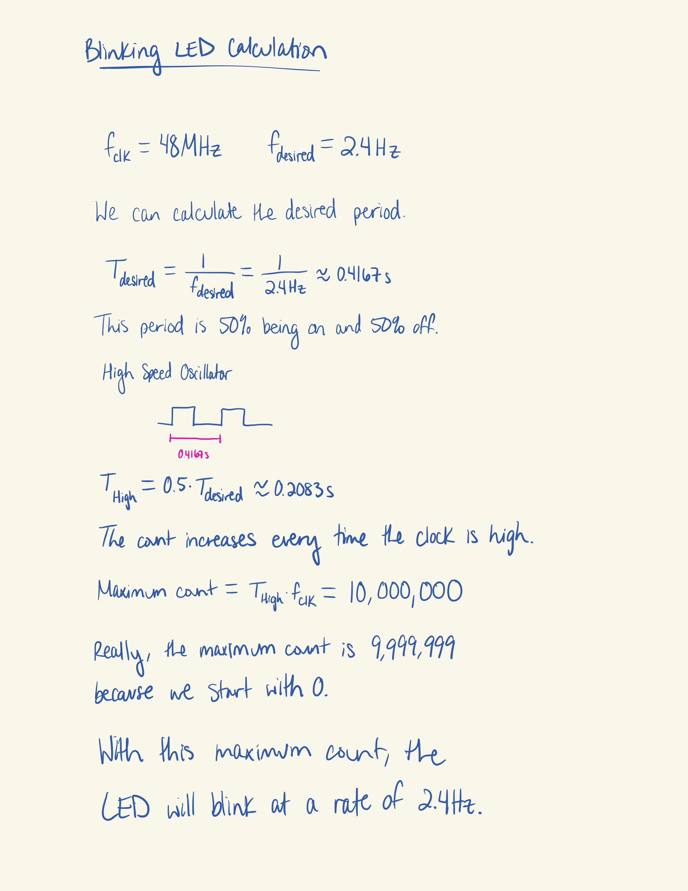
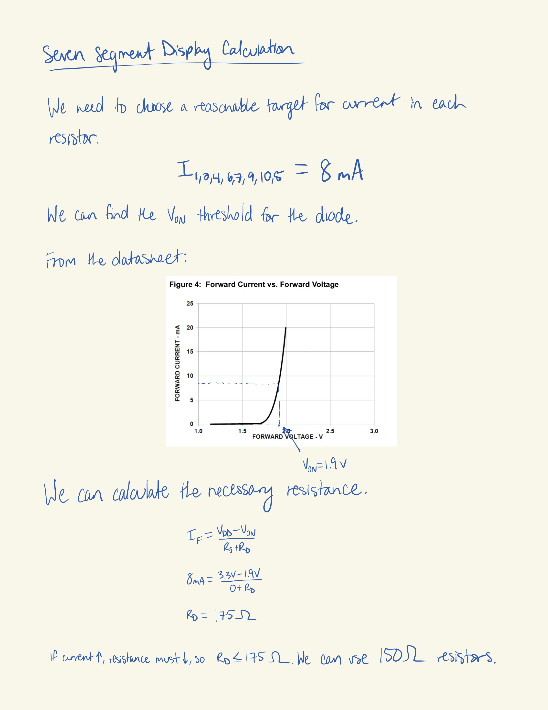
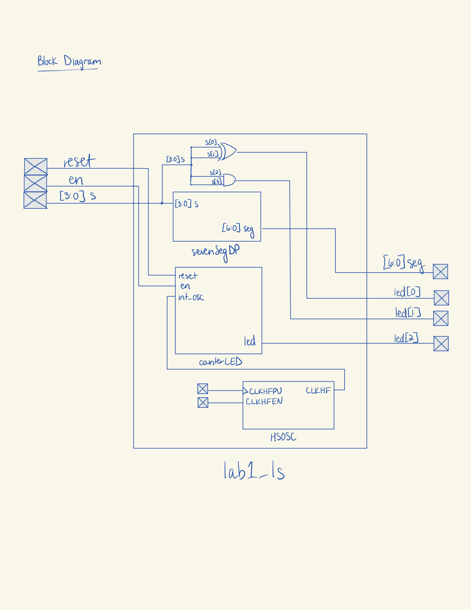
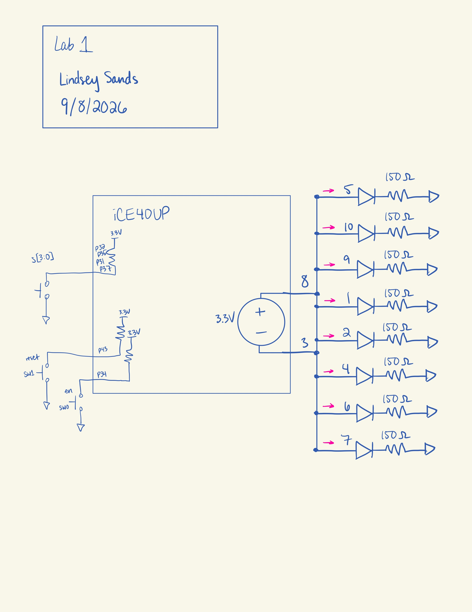
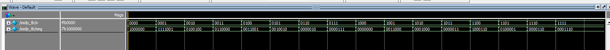
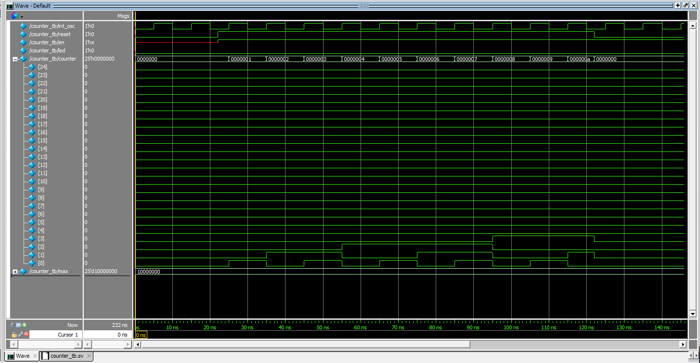
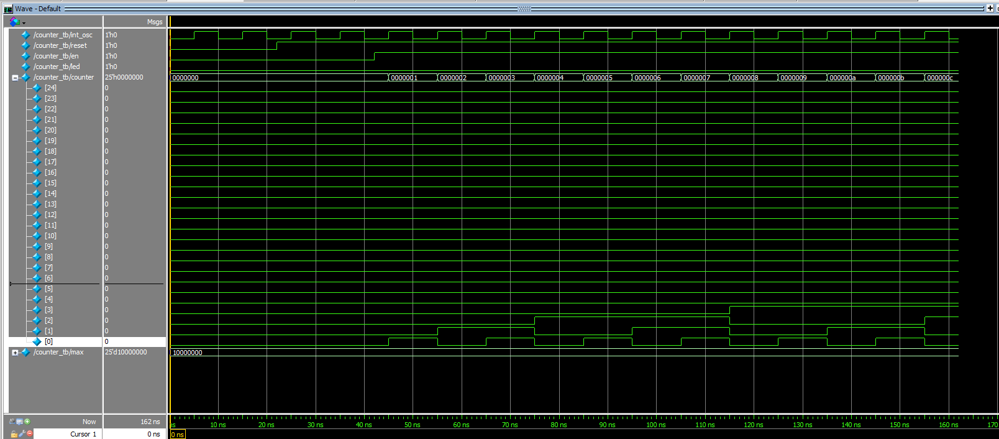
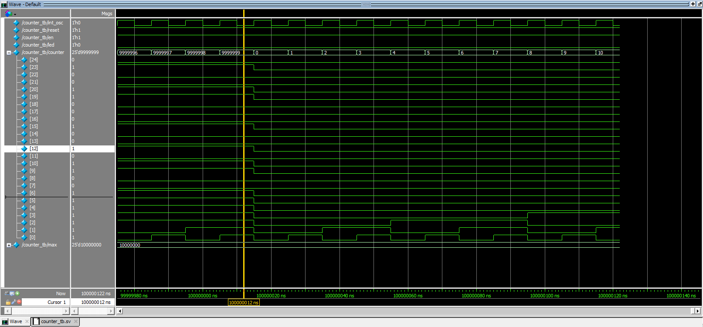
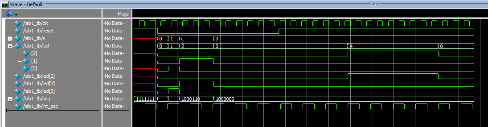

## Introduction
In this lab, an FPGA was programmed to control multiple LEDs. One LED blinked at 2.4 Hz. Two other LEDs executed AND and XOR operations based on a 4-bit switch input. Finally, the last 7 LEDs were part of a seven segment display and are configured to display the hex digits from 0x0 to 0xF based on the same switch input. 

## Design and Testing Methodology
For the blinking LED, a 48 MHz clock signal was generated from the on-board high-speed oscillator (HSOSC) from the iCE40 UltraPlus primitive library.

The necessary maximum count for a counter module was calculated in order to turn the 48 MHz input into the 2.4 Hz output, as shown in Figure 1 below. 

{width=80%}

Using this calculation, a counter module was designed with parameters of width and maximum count set to 24'd10_000_000 and 25, respectively. The counter module also has reset and enable functionality. 

Additionally, there were calculations performed to figure out the proper pull-down resistor size for the seven segment display LEDs. Using the information from the data, a target current draw of 8mA was chosen. 

{width=80%}

A standard resistor size of 150 Ω based on the calculation in Figure 2.

The top module handles the logic of the last two LEDs, assigning the XOR and AND logic. The top module is also where the HSOSC, counter, and seven segment display modules are all integrated together. 

## Technical Documentation
The source code for the project can be found in the associated [Github repository](https://github.com/lsands5400/e155-lab1.git).

Code:
::: {.callout-caution collapse="true" title="Click for Questa Simulation"}
// Lindsey Sands
// lsands@g.hmc.edu
// 09-06-2026
// This is the top module for E155 Lab 1.
module lab1_ls(input logic reset, en,
				input logic[3:0] s,
				
				output logic[2:0] led, 
				output logic[6:0] seg);
				
	logic int_osc;
				
	// Internal high-speed oscillator
	HSOSC #(.CLKHF_DIV(2'b00))
		clk (.CLKHFPU(1'b1), .CLKHFEN(1'b1), .CLKHF(int_osc));
	
	// Seven Segment Display module instantiation
	sevenSegDP dp(s, seg);
	
	// led[0] = s[1] XOR s[0]
	assign led[0] = s[1] ^ s[0];
	
	// led[1] = s[3] AND s[2]
	assign led[1] = s[3] && s[2];
	
	// led[2] blinks at 2.4Hz
	counterLED counter(int_osc, reset, en, led[2]);
	
endmodule

// Lindsey Sands
// lsands@g.hmc.edu
// 09-06-2026
// This is the Seven Segment Display module. It takes a binary input value and 
// outputs the right LED configuration to visually represent the hex digit (0x0-0xF)
module sevenSegDP(input logic[3:0] s,
					output logic[6:0] seg);
	
	always_comb
		case(s)
			4'b0000: seg = 7'b1000000; // 0
			4'b0001: seg = 7'b1111001; // 1
			4'b0010: seg = 7'b0100100; // 2
			4'b0011: seg = 7'b0110000; // 3
			4'b0100: seg = 7'b0011001; // 4
			4'b0101: seg = 7'b0010010; // 5
			4'b0110: seg = 7'b0000010; // 6
			4'b0111: seg = 7'b0000111; // 7
			4'b1000: seg = 7'b0000000; // 8
			4'b1001: seg = 7'b0011000; // 9
			4'b1010: seg = 7'b0001000; // A
			4'b1011: seg = 7'b0000011; // b
			4'b1100: seg = 7'b1000110; // C
			4'b1101: seg = 7'b0100001; // d
			4'b1110: seg = 7'b0000110; // E
			4'b1111: seg = 7'b0001110; // F
			default: seg = 7'b1111111;
		endcase
		
endmodule
			
// Lindsey Sands
// lsands@g.hmc.edu
// 09-06-2026
// This is the counter module for E155 Lab 1. It blinks an LED at 2.4Hz. 
// The code is based on the demo at 
// https://hmc-e155.github.io/tutorials/tutorial-posts/lattice-radiant-ice40-ultraplus-project-setup/
module counterLED #(parameter width = 25,
					parameter max = 24'd10_000_000)
					(input logic int_osc, reset, en,
					 output logic led);
					 
	logic [width-1:0] counter; 
	// Counter
	always_ff@(posedge int_osc, negedge reset) begin
		// Reset count if reset button pushed or count gets to maximum value
		// Reset is active LOW
		if((reset == 0)||(counter == max-1)) counter <= 0;
			
		// Increment counter the same if enable is on		
		else if(en)		   				  counter <= counter + 1;
		else							  counter <= counter;
	end
	
	// Assign LED output
	assign led = counter[width-1];

endmodule

Test benches:
// Lindsey Sands
// lsands@g.hmc.edu
// 9/7/2026
// This is the testbench for the Lab 1 top module.
`timescale 1 ns/1 ns

module lab1_tb();
  logic           clk;    // system clock
  logic           reset;  // active high reset
  logic   [3:0]   s;      // 4-bit input switches
  logic   [2:0]   led;    // 3 output leds
  logic   [6:0]   seg;    // seven segment display
  logic 		  int_osc;
  logic			  counter;
  logic			  en;
 
 assign en = 1;

    lab1_ls dut (
        .reset(reset),
		.en(en),
        .s(s),
        .led(led),
		.seg(seg)
    );
	
	HSOSC #(.CLKHF_DIV(2'b00))
		dut2 (.CLKHFPU(1'b1), .CLKHFEN(1'b1), .CLKHF(int_osc));

  // generate clock
  always begin
      clk = 0; #5;
      clk = 1; #5;
  end

  // apply stimuli and check outputs
  initial begin
    reset = 1;
    #22 reset = 0;

    // No-LED test
	s = 4'b0000;                // setup inputs
	#10;                        // wait required time
	assert (led == 2'b00)       // check outputs
	else 
		$error("No-LED test failed."); 
		
    // LED[0] test
	s = 4'b0001;
	#10;
	assert (led == 2'b01)
	else 
		$error("LED[0] test failed.", $time); 

    // LED[1] test
	s = 4'b1100;
	#10;
	assert (led == 2'b10)
	else 
		$error("LED[1] test failed.", $time); 
        
    // HSOSC test
	#22;
	assert (int_osc == 1)
	else 
		$error("HSOSC failed.", $time); 

    // Seven Segment Display integration test
    s = 4'b0000;
	#10;
	assert (seg == 7'b1000000)
	else 
		$error("Seven segment display integration failed.", $time); 

    // Counter integration test
	reset = 0;
    #50 reset = 1; 
	#80
	assert (led[2] == 1)
	else 
		$error("Counter integration failed.", $time); 

    #100 $stop;
  end
endmodule

// Lindsey Sands
// lsands@g.hmc.edu
// 9/7/2026
// This is the testbench for the counter module.
`timescale 1 ns/1 ns

module counter_tb();
	logic			int_osc; 
    logic           reset;  // active high reset
    logic           en;     // enable
    logic           led;    // output LED
    logic [24:0]    counter; // counter
    logic [24:0]          max;    // max count
	
	assign max = 24'd10_000_000;

    counterLED dut(
		.int_osc(int_osc),
        .reset(reset),
        .en(en),
        .led(led)
    );

    // generate clock
    always begin
        int_osc = 0; #5;
        int_osc = 1; #5;
    end
	
	// Counter
	always_ff@(posedge int_osc, negedge reset) begin
		// Reset count if reset button pushed or count gets to maximum value
		// Reset is active LOW
		if((reset == 0)||(counter == max-1)) counter <= 0;
			
		// Increment counter the same if enable is on		
		else if(en)		   				  counter <= counter + 1;
		else							  counter <= counter;
	end

    // apply stimuli and check outputs
    initial begin
		// verify reset (Reset is active low)
		reset = 0;
		#22 reset = 1;            
		en = 1;
		#100;                        // wait required time
		assert (counter > 0)       // check outputs
		else 
			$error("Reset test 1 failed.");
		reset = 0;	
		#10;
		assert (counter == 0)       // check outputs
		else 
			$error("Reset test 2 failed."); 
		// verify enable
		reset = 0;
		en = 0;
		#22 reset = 1;              
		#50;
		assert (counter == 0)
		else 
			$error("Enable test 1 failed.");
		en = 1;
		#50;
		assert (counter != 0)
		else 
			$error("Enable test 2 failed."); 
		// verify max count
		reset = 0;
		#22 reset = 1;          
		en = 1;
		#100_000_000;
		assert (counter == 0)
		else 
			$error("Max count test failed."); 

        #100 $stop;
    end
endmodule

// Lindsey Sands
// lsands@g.hmc.edu
// 9/7/2026
// This is the testbench for the seven segment display module. 
// It covers every single case of input bits.
`timescale 1 ns/1 ns

module ssdp_tb();
    logic   [3:0]   s;    // 4 input bits
    logic   [6:0]   seg; // Seven segment display LEDs

    // instantiate device under test
    sevenSegDP dut(.s(s),
                    .seg(seg));

    // apply inputs one at a time
    // checking results
    initial begin
        s = 4'b0000; #10;
        assert (seg == 7'b1000000) else $error("0000 (0) failed.");
        s = 4'b0001; #10;
        assert (seg==7'b1111001) else $error("0001(1) failed.");
        s = 4'b0010; #10;
        assert (seg== 7'b0100100) else $error("0010(2) failed.");
        s = 4'b0011; #10;
        assert (seg== 7'b0110000) else $error("0011(3) failed.");
        s = 4'b0100; #10;
        assert (seg== 7'b0011001) else $error("0100(4) failed.");
        s = 4'b0101; #10;
        assert (seg== 7'b0010010) else $error("0101(5) failed.");
        s = 4'b0110; #10;
        assert (seg== 7'b0000010) else $error("0110(6) failed.");
        s = 4'b0111; #10;
        assert (seg== 7'b0000111) else $error("0111(7) failed.");
        s = 4'b1000; #10;
        assert (seg== 7'b0000000) else $error("1000(8) failed.");
        s = 4'b1001; #10;
        assert (seg== 7'b0011000) else $error("1001(9) failed.");
        s = 4'b1010; #10;
        assert (seg== 7'b0001000) else $error("1010(A) failed.");
        s = 4'b1011; #10;
        assert (seg== 7'b0000011) else $error("1011(b) failed.");
        s = 4'b1100; #10;
        assert (seg== 7'b1000110) else $error("1100(C) failed.");
        s = 4'b1101; #10;
        assert (seg== 7'b0100001) else $error("1101(d) failed.");
        s = 4'b1110; #10;
        assert (seg== 7'b0000110) else $error("1110(E) failed.");
        s = 4'b1111; #10;
        assert (seg== 7'b0001110) else $error("1111(F) failed.");
		
		#100 $stop;
    end
endmodule
:::
# Block Diagram 
{width=80%}

# Schematic
{width=80%}

## Results and Discussion
# Testbench Simulation
All of the testbenches ran successfully with no errors. 

::: {.callout-caution collapse="true" title="Click for Questa Simulation"}
{width=100%}
:::
All 16 LED configurations work. 

::: {.callout-caution collapse="true" title="Click for Questa Simulation"}
{width=100%}
The active low reset functionality sets the counter back to zero.
:::

::: {.callout-caution collapse="true" title="Click for Questa Simulation"}
{width=100%}
:::
When high, enable allows the counter to increment. When low, the counter stays at the same value unless reset is pressed.

::: {.callout-caution collapse="true" title="Click for Questa Simulation"}
{width=100%}
:::
When the counter reaches the maximum count, instead of continuing to count up, it resets to 0.

::: {.callout-caution collapse="true" title="Click for Questa Simulation"}
{width=100%}
:::
All of the integrated modules and LED logic works. 

## Conclusion
TODO: Did everything work?
I spent about 25-30 hours on this lab.

## AI Prototype Summary
TODO: Finish this
