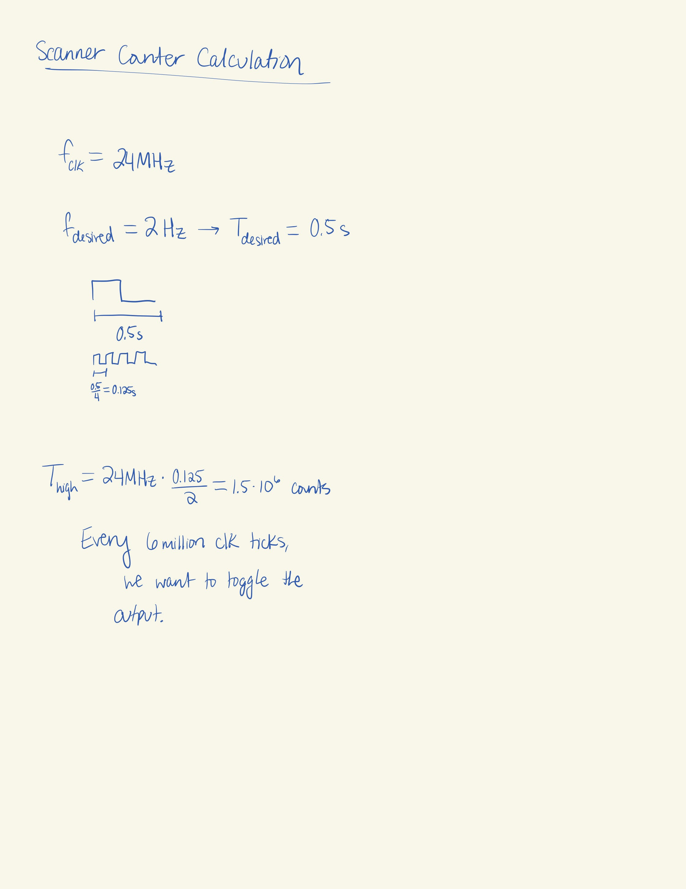
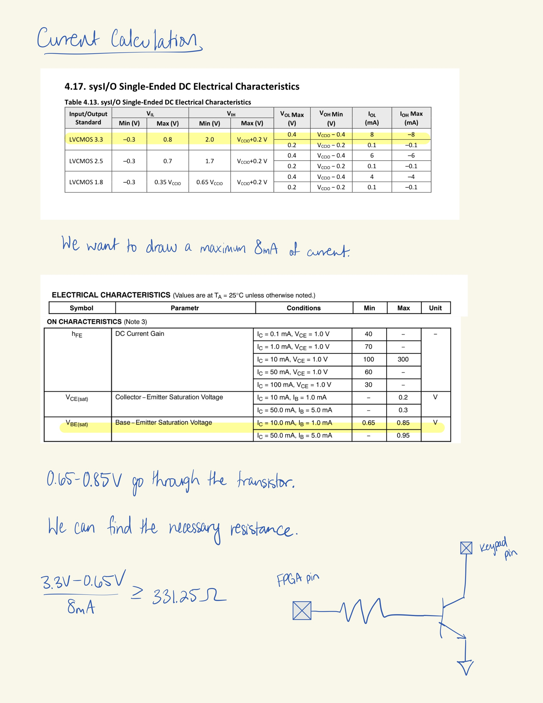
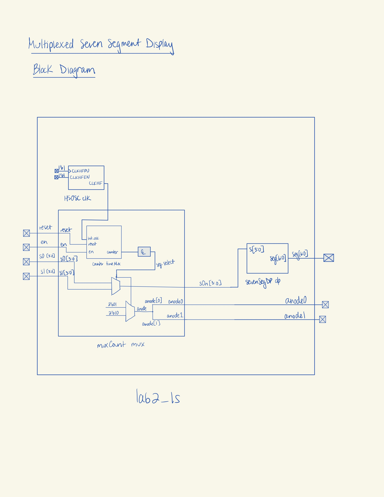
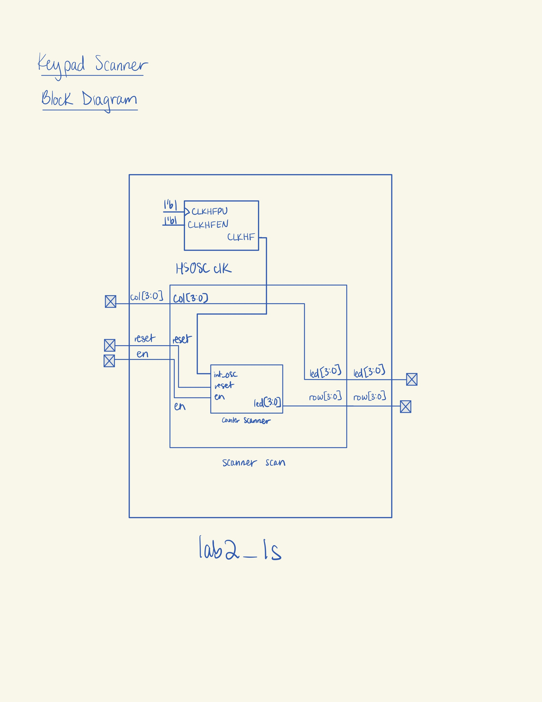
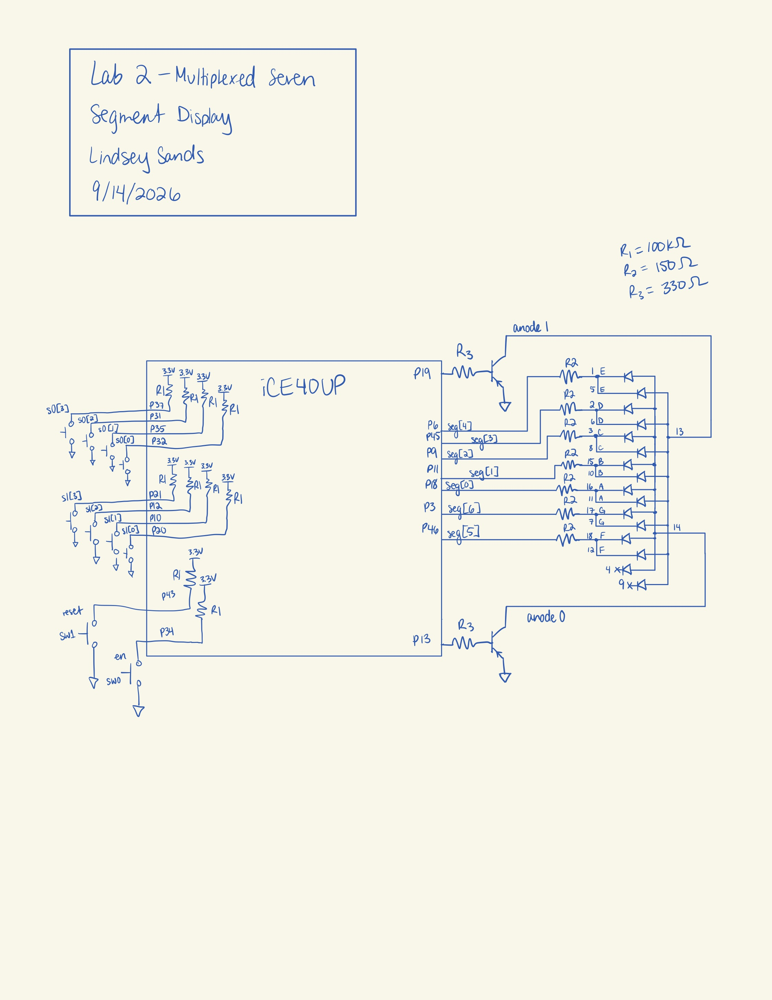
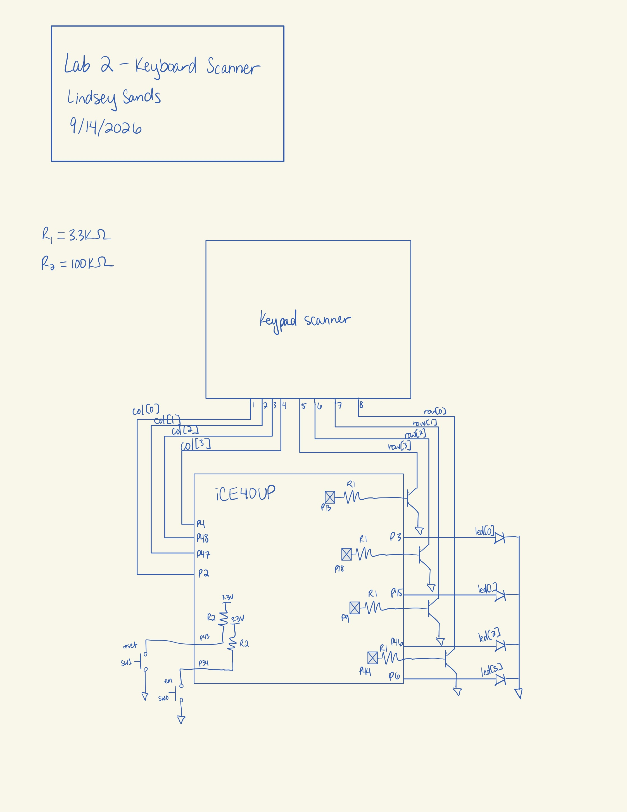
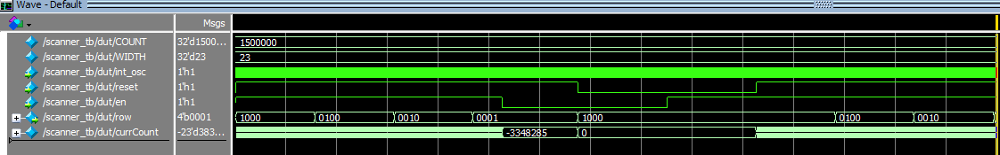
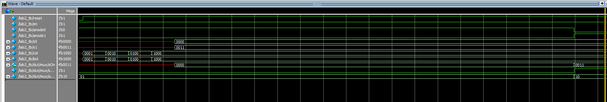

## Introduction
In this lab, an FPGA was programmed to create multiplexer functionality for a dual seven segment display. Additionally, the FPGA was programmed to scan a keypad for pressed inputs. 

## Design and Testing Methodology
For both designs, a 48 MHz clock signal was generated from the on-board high-speed oscillator (HSOSC) from the iCE40 UltraPlus primitive library.

The counter module from Lab 1 was reused for both designs. For the keypad scanner, the parameters were set to width = 23 and max = 1,500,000 based on the required output frequency of 2 Hz, as calculated below. 

{width=80%}

The scanner module also has enable and reset functionality. 

Additionally, there were calculations performed to figure out the proper pull-down resistor size for the transistor to draw enough current for the anodes of the seven segment display.

{width=80%}

A standard resistor size of 330 Ω was chosen based on the calculation in Figure 2.

Due to the number of pins required, the designs are split into two different top modules and run with two different .bin files.

## Technical Documentation
The source code for the project can be found in the associated [Github repository](https://github.com/lsands5400/e155-Lab-2).

# Block Diagrams 
{width=80%}

{width=80%}

# Schematics

{width=80%}

{width=80%}

## Results and Discussion

# Testbench Simulation
All of the testbenches ran successfully with no errors. 

::: {.callout-caution collapse="true" title="Click for Questa Simulation"}
{width=100%}
:::

The scanner testbench successfully demonstrates all four output transitions, enable and reset features.

::: {.callout-caution collapse="true" title="Click for Questa Simulation"}
{width=100%}
:::

The top module exercises multiplexing functionality and LED driving functionality.

## Conclusion

Both the multiplexed seven segment display and keypad scanner worked! I worked on the lab for ~22 hours.

## AI Prototype Summary

I had AI generate code based on the given prompt.

::: {.callout-caution collapse="true" title="Click for AI Code"}

// Lindsey Sands
// Time-multiplex two 7-segment displays using one decoder

module seven_seg_mux (
    input  logic        clk,
    input  logic [3:0]  input0,
    input  logic [3:0]  input1,

    output logic [6:0]  seg0,
    output logic [6:0]  seg1
);

    // Counter used to switch between the two displays
    logic mux_select;

    // Output of the single 4-bit -> 7-segment decoder
    logic [6:0] decoder_out;

    // Divide the clock down so the displays alternate
    // at a rate fast enough for persistence of vision.
    logic [19:0] counter;

    always_ff @(posedge clk) begin
        counter <= counter + 1'b1;

        if (counter == 20'd0)
            mux_select <= ~mux_select;
    end

    // Select which 4-bit input goes to the decoder
    always_comb begin
        if (mux_select)
            decoder_out = seven_seg_decode(input1);
        else
            decoder_out = seven_seg_decode(input0);
    end

    // Send decoder output to the selected display.
    // The other display is blanked.
    always_comb begin
        if (mux_select) begin
            seg0 = 7'b1111111;   // off (common anode)
            seg1 = decoder_out;
        end
        else begin
            seg0 = decoder_out;
            seg1 = 7'b1111111;   // off (common anode)
        end
    end

    // Single 4-bit -> 7-segment decoder
    function automatic logic [6:0] seven_seg_decode(input logic [3:0] value);
        case (value)
            4'h0: seven_seg_decode = 7'b1000000;
            4'h1: seven_seg_decode = 7'b1111001;
            4'h2: seven_seg_decode = 7'b0100100;
            4'h3: seven_seg_decode = 7'b0110000;
            4'h4: seven_seg_decode = 7'b0011001;
            4'h5: seven_seg_decode = 7'b0010010;
            4'h6: seven_seg_decode = 7'b0000010;
            4'h7: seven_seg_decode = 7'b1111000;
            4'h8: seven_seg_decode = 7'b0000000;
            4'h9: seven_seg_decode = 7'b0010000;
            4'hA: seven_seg_decode = 7'b0001000;
            4'hB: seven_seg_decode = 7'b0000011;
            4'hC: seven_seg_decode = 7'b1000110;
            4'hD: seven_seg_decode = 7'b0100001;
            4'hE: seven_seg_decode = 7'b0000110;
            4'hF: seven_seg_decode = 7'b0001110;
            default: seven_seg_decode = 7'b1111111;
        endcase
    endfunction

endmodule

:::

Then, I gave it the context of my previous counter and seven segment display modules.

::: {.callout-caution collapse="true" title="Click for AI Code"}

// Lindsey Sands
// lsands@g.hmc.edu
// 09-16-2026
//
// Time multiplexes one seven-segment decoder between
// two 4-bit inputs and two 7-bit outputs.
//
// The seven-segment decoder is common-anode, so:
//   0 = LED segment ON
//   1 = LED segment OFF
//
// Each display is alternately driven so that both
// appear to be displaying their respective values.

module sevenSegMux #(
    parameter int width = 16,
    parameter int max   = 50_000
)(
    input  logic       int_osc,
    input  logic       reset,
    input  logic [3:0] s1,
    input  logic [3:0] s2,
    output logic [6:0] seg1,
    output logic [6:0] seg2
);

    // Counter used to control multiplexing frequency
    logic [width-1:0] mux_counter;

    // Selects which display is currently active
    logic mux_select;

    // Output of the single seven-segment decoder
    logic [6:0] decoded_seg;

    // Instantiate the provided counter
    counter #(
        .width(width),
        .max(max)
    ) mux_counter_inst (
        .int_osc(int_osc),
        .reset(reset),
        .en(1'b1),
        .counter(mux_counter)
    );

    // Use the most significant counter bit to switch
    // between the two displays.
    assign mux_select = mux_counter[width-1];

    // Select which 4-bit input goes into the decoder
    logic [3:0] mux_input;

    always_comb begin
        if (mux_select)
            mux_input = s2;
        else
            mux_input = s1;
    end

    // Instantiate the provided seven-segment decoder
    sevenSegDP decoder (
        .s(mux_input),
        .seg(decoded_seg)
    );

    // Send the decoder output to the currently selected
    // display and turn the other display OFF.
    always_comb begin

        if (!mux_select) begin
            seg1 = decoded_seg;
            seg2 = 7'b1111111;   // all segments OFF
        end

        else begin
            seg1 = 7'b1111111;   // all segments OFF
            seg2 = decoded_seg;
        end

    end

endmodule

:::

The first was able to synthesize. It was interesting because it manually set the other anode to all 0 bits instead of controlling the anode. 

The second also succeeded in synthesis. It uses a similar strategy to that above but with my given modules. 

Both outputs seem pretty reasonable.