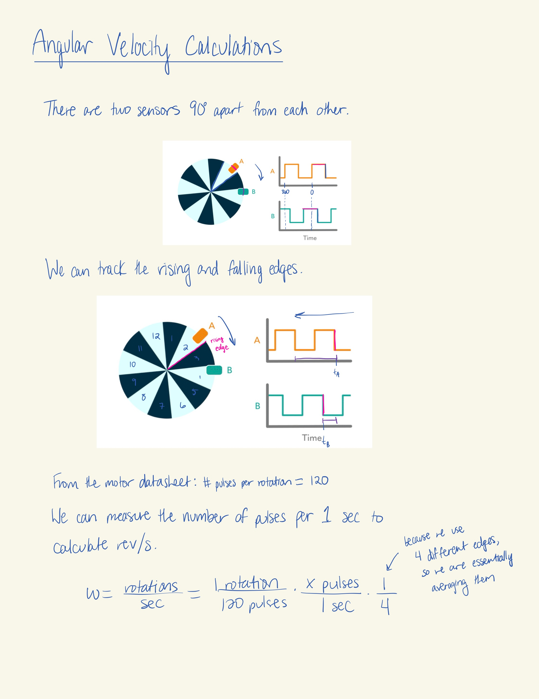
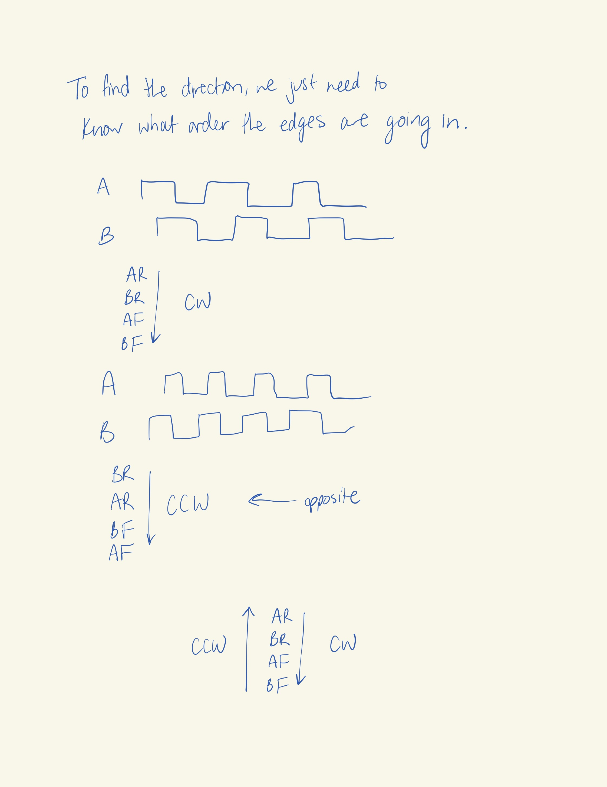
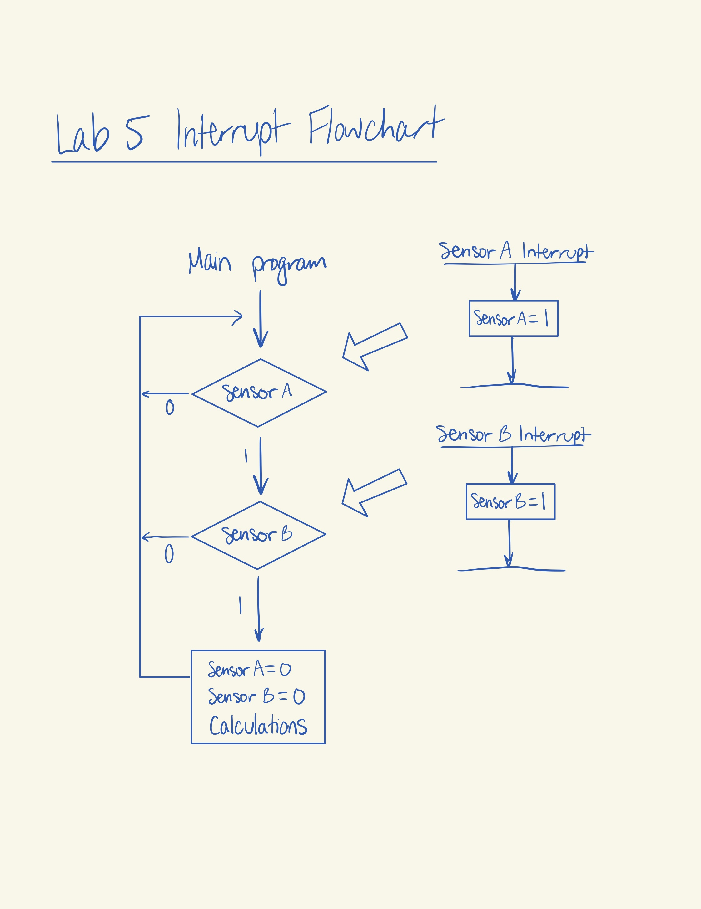
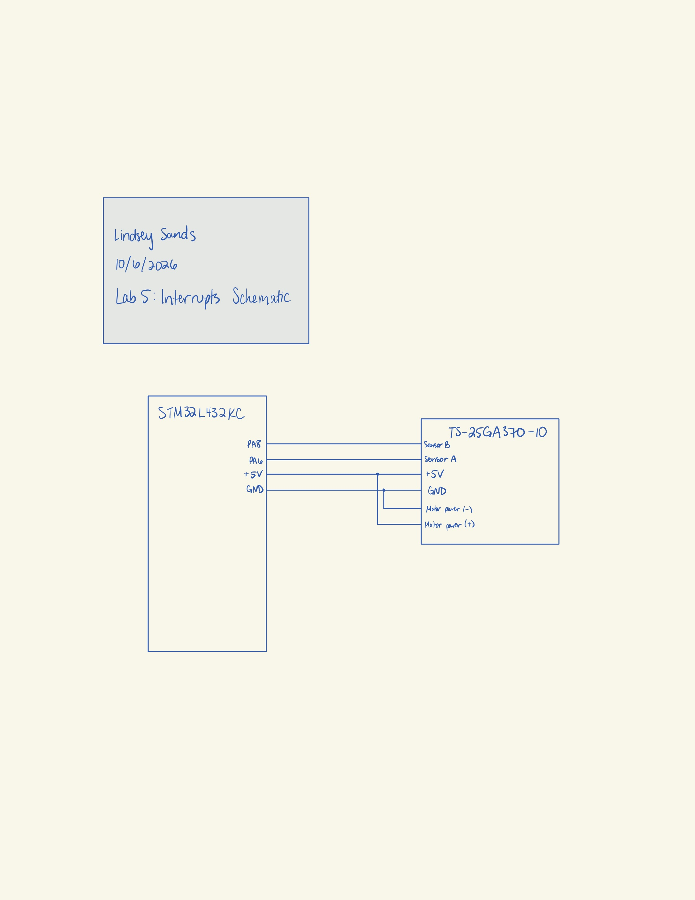
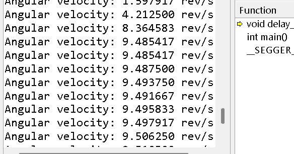

## Introduction
In this lab, an MCU was programmed to take data from a quadrature encoder on a motor and calculate the angular velocity output of the motor.

## Design and Testing Methodology
To calculate the angular velocity, we need to take advantage of the positions of the two sensors in the quadrature encoder. 

{width=80%}

{width=80%}

To ensure an update rate of at least 1 Hz, we can use the delaymillis() from the TIMx library. With a base of 1 ms for the counter, we can set the delay to 1000 ms to get an output of 1 Hz. The velocity will update every 1 second interval.

## Technical Documentation
The source code for the project can be found in the associated [Github repository](https://github.com/lsands5400/e155-lab-5/tree/main).

# Flowchart
The flowchart for the interrupts is as shown below.

{width=80%}

# Schematics
The connection from the MCU to the motor is as shown below.

{width=80%}

## Results and Discussion
Based on an rpm of 600 for the motor, the output velocity in revolutions per sec should be about 10 rev/s. As seen in the terminal screenshot below, the output velocity calculated by the quadrature encoder hovered around 9.5 rev/s once it reached steady state. This is about 5% error. The difference might be due to the resolution of the power supply or of the MCU. But it is most likely due to the age of the motor and decay in performance over time. 

{width=80%}

The interrupt method is better than manual polling. At 12V, code with manual polling used instead of interrupts produced a nonsensical value of 0.002083 rev/s for the velocity, as shown below. This is because it is not possible for the program to poll the correct amount of times. The time it takes to poll is too high for the program to catch all polling in the 1 second period.

{width=80%}

## Conclusion
The MCU correctly calculates the velocity from the quadrature encoder at about 9.5 rev/s at 12V. I spent about 20 hours working on this lab. 

## AI Prototype Summary
I used the prompt given to generate code from ChatGPT. I had to add a few prompts after to get a working piece of code which is shown below. 

::: {.callout-caution collapse="true" title="Click for AI Code"}

#include "STM32L432KC.h"
#include <stdint.h>
#include <stdio.h>

volatile int32_t encoder_count = 0;
volatile uint8_t encoder_state = 0;

/*
 * Encoder:
 *   A -> PA8
 *   B -> PA6
 *
 * Both inputs generate interrupts on rising and falling edges.
 */

void encoder_init(void)
{
    /* Enable GPIOA clock */
    RCC->AHB2ENR |= RCC_AHB2ENR_GPIOAEN;

    /* Enable SYSCFG clock */
    RCC->APB2ENR |= RCC_APB2ENR_SYSCFGEN;

    /*
     * PA6 and PA8 as inputs
     *
     * MODER = 00 -> input
     */
    GPIOA->MODER &= ~(GPIO_MODER_MODE6_Msk |
                      GPIO_MODER_MODE8_Msk);

    /*
     * Pull-ups
     *
     * Encoder outputs should pull the inputs LOW when active.
     */
    GPIOA->PUPDR &= ~(GPIO_PUPDR_PUPD6_Msk |
                      GPIO_PUPDR_PUPD8_Msk);

    GPIOA->PUPDR |= (0b01 << GPIO_PUPDR_PUPD6_Pos) |
                    (0b01 << GPIO_PUPDR_PUPD8_Pos);

    /*
     * Configure EXTI6 -> PA6
     * Configure EXTI8 -> PA8
     *
     * EXTICR2 controls EXTI4-7
     * EXTICR3 controls EXTI8-11
     *
     * 0000 = GPIOA
     */

    SYSCFG->EXTICR[1] &= ~SYSCFG_EXTICR2_EXTI6_Msk;
    SYSCFG->EXTICR[2] &= ~SYSCFG_EXTICR3_EXTI8_Msk;

    /*
     * Enable EXTI interrupts
     */
    EXTI->IMR1 |= EXTI_IMR1_IM6;
    EXTI->IMR1 |= EXTI_IMR1_IM8;

    /*
     * Trigger on BOTH rising and falling edges
     */
    EXTI->RTSR1 |= EXTI_RTSR1_RT6;
    EXTI->RTSR1 |= EXTI_RTSR1_RT8;

    EXTI->FTSR1 |= EXTI_FTSR1_FT6;
    EXTI->FTSR1 |= EXTI_FTSR1_FT8;

    /*
     * Initialize encoder state
     */
    encoder_state =
        ((GPIOA->IDR >> 6) & 0x01) << 1 |
        ((GPIOA->IDR >> 8) & 0x01);

    /*
     * Enable EXTI9_5 interrupt.
     *
     * PA6 and PA8 both use this interrupt vector.
     */
    NVIC_EnableIRQ(EXTI9_5_IRQn);
}

void EXTI9_5_IRQHandler(void)
{
    /*
     * Check whether PA6 generated the interrupt.
     */
    if (EXTI->PR1 & EXTI_PR1_PIF6)
    {
        EXTI->PR1 = EXTI_PR1_PIF6;
    }

    /*
     * Check whether PA8 generated the interrupt.
     */
    if (EXTI->PR1 & EXTI_PR1_PIF8)
    {
        EXTI->PR1 = EXTI_PR1_PIF8;
    }

    /*
     * Read both encoder channels.
     *
     * State format:
     *
     *   bit 1 = PA6 (B)
     *   bit 0 = PA8 (A)
     */
    uint8_t new_state =
        (((GPIOA->IDR >> 6) & 0x01) << 1) |
        ((GPIOA->IDR >> 8) & 0x01);

    /*
     * Combine old and new states into a
     * 4-bit transition value.
     */
    uint8_t transition =
        (encoder_state << 2) | new_state;

    /*
     * Valid clockwise transitions
     */
    switch (transition)
    {
        case 0b0001:
        case 0b0111:
        case 0b1110:
        case 0b1000:
            encoder_count++;
            break;

        /*
         * Valid counter-clockwise transitions
         */
        case 0b0010:
        case 0b1011:
        case 0b1101:
        case 0b0100:
            encoder_count--;
            break;

        /*
         * Invalid transition:
         * probably noise or a skipped state.
         */
        default:
            break;
    }

    /*
     * Save current state for next interrupt.
     */
    encoder_state = new_state;
}

int main(void)
{
    // Initialize the encoder pins and EXTI interrupts
    encoder_init();

    printf("Encoder test started!\r\n");

    while (1)
    {
        printf("Encoder count: %ld\r\n", encoder_count);

        // Simple delay so we don't spam the terminal
        for (volatile uint32_t i = 0; i < 1000000; i++);
    }

    return 0;
}

:::

This code built in Segger and when run, it worked. I got varying encoder values in the terminal. However, originally, ChatGPT chose pins PA0 and PA1. Because of that, it had to create two separate interrupt handler functions. I asked it to switch the pins to the ones I used for the project (PA6 and PA8) because I didn't feel like switching the pins around, nor double checking that PA0 and PA1 are 5V tolerant. It also then condensed the code into one interrupt handling function. Finally, I had it add print statements so I could see what was happening in the terminal. 

As far as code quality, it hard-coded the actual pin numbers which is not very conducive to easy pin changes. It also had an interesting approach to the direction (cw/ccw) calculation that is definitely clearer than my own, but much longer. 

Based on this investigation, I think that AI would be efficient in generating the code for interrupts if the prompter already has some specific details in mind. I think the given prompt is probably a little too sparse to generate perfect code on the first run. 